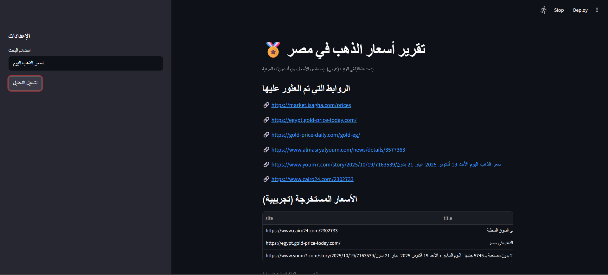
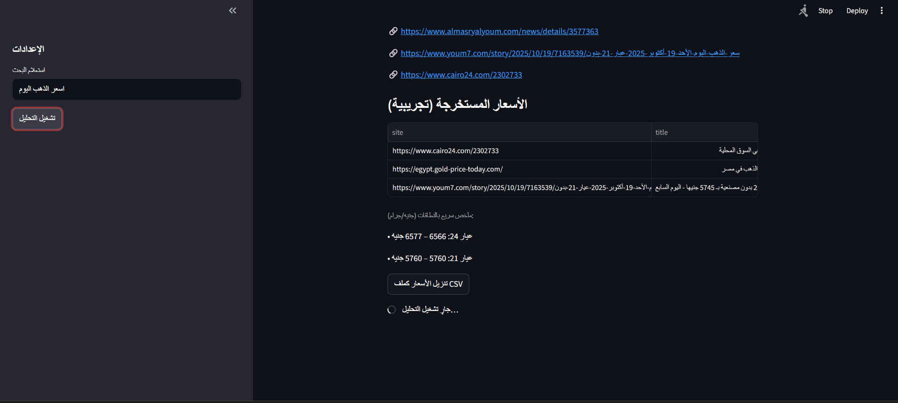
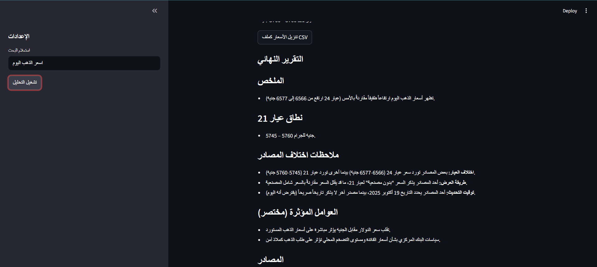
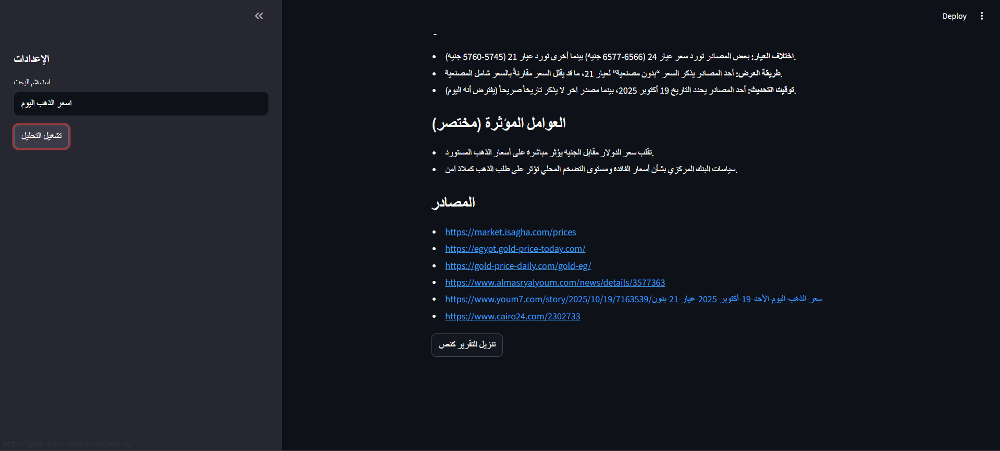
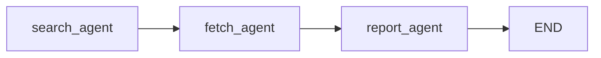

# gold-eg-report-langgraph

> **Arabic, Egypt-only gold price reporter** — built with **LangGraph** (multi-agent flow) + **Streamlit** UI.  
> Searches Arabic web sources, extracts **EGP/gram** prices (18/21/24 karat), separates **بدون/بالمصنعية**, and generates a concise Arabic report via LLM.

---

## 🚀 Why this repo?
An interview-ready, minimal-yet-solid demo of **agentic workflows** using **LangGraph** — with a real use case (gold prices in Egypt, today).  
It proves you can:
- Design a **multi-agent** graph (`search → fetch → report`).
- Parse Arabic pages, normalize numbers, and **filter noise** reliably.
- Produce a clean **Arabic** report and a **Streamlit** dashboard.

---

## 🧰 Tech stack
- **LangGraph** (agentic state machine)
- **LangChain + Groq (langchain-groq)** for LLM calls
- **Streamlit** (Arabic UI)
- **DDGS** (DuckDuckGo search API)
- **BeautifulSoup + requests + tenacity** (scrape + robust retries)
- **pytz** (Africa/Cairo time), **pandas** (CSV export)

---

## 📸 Screenshots

<p align="center">
  
</p>
<p align="center">
  
</p>
<p align="center">
  
</p>
<p align="center">
  
</p>
```

---

## 🗂 Project structure
```
.
├─ app.py               # Streamlit UI (Arabic), CSV/report downloads, 21k split rendering
├─ agents.py            # search_agent, fetch_agent, report_agent (+ Groq wrapper)
├─ graph.py             # LangGraph graph: search → fetch → report
├─ prompts.py           # Strict Egypt-only Arabic reporting prompt
├─ scraper.py           # Search + fetch + parse (EGP-only, year-guard, context check, مصنعية flag)
├─ utils.py             # now_cairo(), normalize_number(), helpers
├─ requirements.txt
└─ screenshots/         # (add PNGs here for the README)
```

---

## ⚙️ Setup
```bash
# Python 3.10 (as requested)
conda create -p venv python==3.10 -y
conda activate ./venv

pip install -r requirements.txt
```

Create a `.env` in the project root:
```bash
# .env
GROQ_API_KEY=your_api_key_here
# Optional: fallback region (kept EG only in app)
DEFAULT_REGION=EG
# Optional: number of sources
MAX_SOURCES=8
# Optional: override Groq model (defaults to llama-3.1-70b-versatile)
GROQ_MODEL=llama-3.1-70b-versatile
```

Run the app:
```bash
streamlit run app.py
```

---

## 🕸 How it works (LangGraph)
**Nodes**
1. **search_agent** → Arabic web search (DDGS), EG-only link filter (drops ounce/USD/Turkey)
2. **fetch_agent** → Fetch pages, parse **EGP/gram**, prefer **اليوم**, compute stats + 21k split (بدون/بالمصنعية)
3. **report_agent** → Build strict Arabic prompt & call Groq LLM → final report

**State keys**
```python
{
  "query": str,           # e.g., "سعر الذهب اليوم"
  "region": "EG",         # hard-coded to Egypt in app.py
  "links": List[str],     # filtered URLs
  "pages": List[dict],    # fetch results (ok/error)
  "prices": List[dict],   # extracted rows (price, currency, karat, with_making, published_hint)
  "stats": dict,          # per-karat min/max/count
  "stats_wm": dict,       # "21:with"/"21:without" → min/max/count
  "report": str           # final Arabic report text
}
```

**Flow (Mermaid)**


---

## ✅ Key features (Egypt-only, Arabic UX)
- **EGP/gram only** — no USD/ounce conversions
- **Year-guard** — prevents “2025 جنيه” false positives
- **Gold-context check** — accepts `<num> جنيه` only in gold context
- **مصنعية flag** — split **عيار 21** into **بدون/بالمصنعية**
- **Freshness preference** — uses simple date hints to prefer **اليوم**
- **CSV & report downloads** — one click for auditing & sharing

---

## 🧪 Quick test checklist
- Query: **سعر الذهب اليوم** → links have no **xau-usd/oz/ounce/turkey**
- Table: all rows show **جنيه/جرام**
- “ملخص سريع”: no year leaks; ranges look sensible
- “تفصيل عيار 21”: shows **بدون/بالمصنعية** when available
- Report: says **غير متاح** for 21k only if stats truly lack it


## 🗺 Roadmap (nice-to-have)
- Freshness badges (اليوم/أمس/غير معروف) per row
- Domain **whitelist/weighting** to stabilize sources
- Simple caching of page HTMLs to avoid re-scrapes
- Unit tests for `normalize_number` & the parser

---

## 🛠 Troubleshooting
- **Empty report / no links:** check internet/DuckDuckGo; raise `MAX_SOURCES`.
- **“GROQ_API_KEY” missing:** add it to `.env`; restart terminal.
- **Model/tool error:** set `GROQ_MODEL=llama-3.1-70b-versatile` (supported) and upgrade `langchain-groq`.
- **Still seeing “2025 جنيه”:** ensure you replaced `scraper.py` with the year-guard version.


---

## 📄 License
MIT (or your preference).


